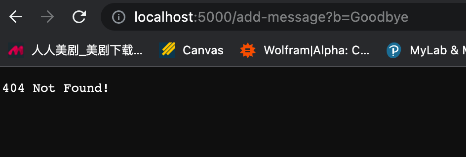
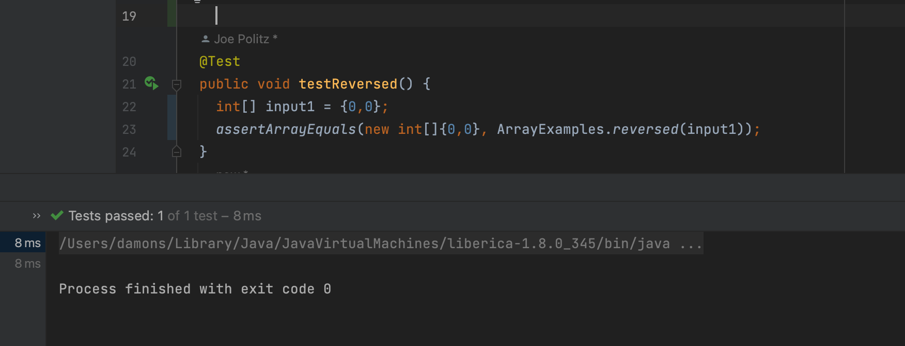

# Lab Report 2
## Part 1
```
import java.io.IOException;
import java.net.URI;

class Handler implements URLHandler {
    // The one bit of state on the server: a number that will be manipulated by
    // various requests.
    String out = "";

    public String handleRequest(URI url) {
        if (url.getPath().equals("/")) {
            return String.format(out);
        } else {
            System.out.println("Path: " + url.getPath());
            if (url.getPath().contains("/add-message")) {
                String[] parameters = url.getQuery().split("=");
                if (parameters[0].equals("s")) {
                    out += parameters[1] + "\n";
                    // System.out.println(out);
                    return String.format(out);
                }
            }
            return "404 Not Found!";
        }
    }
}

class myServer {
    public static void main(String[] args) throws IOException {
        if(args.length == 0){
            System.out.println("Missing port number! Try any number between 1024 to 49151");
            return;
        }

        int port = Integer.parseInt(args[0]);

        Server.start(port, new Handler());
    }
}

```

Screenshot 1


- The main and the handleRequest are called.
- The relevant argument is `url` which changes based on input. The variable `out` is a relevant field in the class since it keep track of the historical inputs. `url.getPath()`, `url.getQuery()`, and `parameters` are also relavant inputs since they changes based on input. (see specific value in the next bullet point)
- After the first call `http://localhost:5000/add-message?s=How%20are%20you`, `url` becomes `/add-message?s=How%20are%20you`, `url.getPath()` becomes `/add-message`, `url.getQuery()` becomes `s=How are you`, and `out` becomes `How are you\n`. Then, after the second call `http://localhost:5000/add-message?s=Goodbye`, `url` becomes `/add-message?s=Goodbye`, `url.getPath()` becomes `/add-message`, `url.getQuery()` becomes `s=Goodbye`, and `out` becomes `How are you\nGoodbye\n`.
- 
Screenshot 2



- The main and the handleRequest are called.
- The relevant argument is `url` which changes based on input. The variable `out` is a relevant field in the class since it keep track of the historical inputs. `url.getPath()`, `url.getQuery()`, and `parameters` are also relavant inputs since they changes based on input. (see specific value in the next bullet point)
- - After the first call `http://localhost:5000/add-message?b=Goodbye`, `url` becomes `/add-message?b=Goodbye`, `url.getPath()` becomes `/add-message`, `url.getQuery()` becomes `b=How are you`. Since the first element in `parameters` is not s, `out` does not change and `404 Not Found!` is returned. 

## Part 2 
The following refers to the reversed method in Array.
- Failure inducing input: 

```
import static org.junit.Assert.*;
import org.junit.*;

public class ArrayTests {
  @Test 
  public void testReversed() {
      int[] input2 = {7,5,3};
      assertArrayEquals(new int[]{3,5,7}, ArrayExamples.reversed(input2));
  }
}
```
- An input that doesn’t induce a failure:

```
import static org.junit.Assert.*;
import org.junit.*;

public class ArrayTests {
  @Test 
  public void testReversed() {
    int[] input1 = {0,0};
    assertArrayEquals(new int[]{0,0}, ArrayExamples.reversed(input1));
  }
}
```
- The symptom:




- Before fix:
```
static int[] reversed(int[] arr) {
    int[] newArray = new int[arr.length];
    for(int i = 0; i < arr.length; i += 1) {
      arr[i] = newArray[arr.length - i - 1];
    }
    return arr;
  }
```
- After fix: 
```
static int[] reversed(int[] arr) {
    int[] newArray = new int[arr.length];
    for(int i = 0; i < arr.length; i += 1) {
      newArray[i] = arr[arr.length - i - 1];
    }
    return newArray;
  }
```
The bug is that the program created an new array full of zeros and tried to copied the zeros into the input array, causing both array to be full of zeros. The fix switch the order, copying values from the input to the new array in a resersed order without changing the input array.  

## Part 3
I did not know how to create a website and using the url to control the website. After this lab , I learnt how to write java files that could start a webpage with a designated server. Specifically, how to write the url handler and got to know teh structure of the Server file. It is important because it introduces me to the world of developing web applications. 

